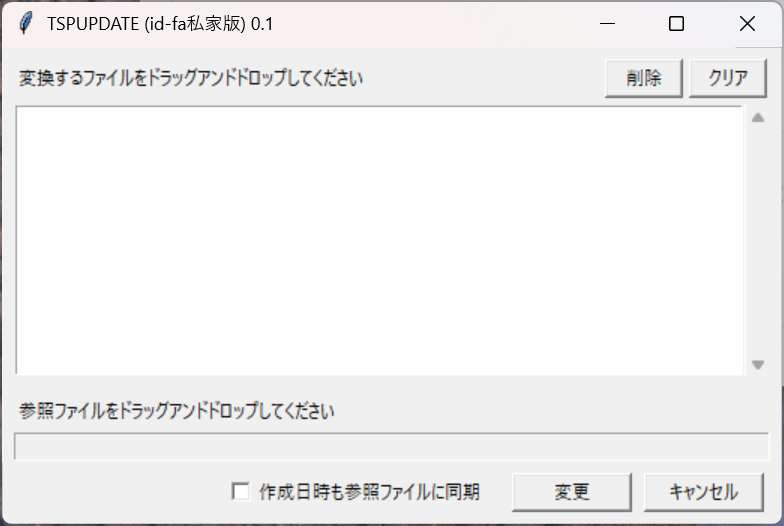

# TSPUPDATE (id-fa私家版)

参照ファイルのタイムスタンプを、ターゲットファイル/フォルダにコピーするWindows用GUIツールです。



元は2006年の2chソフトウェア板[「こんなソフトウェアつくってください!〜Part7〜」スレ](http://pc7.2ch.net/test/read.cgi/software/1146356666/481-496)で作成された TSPUPDATE です。同等の機能をPython + tkinterで再実装しました。

## 機能

- 参照ファイルの**更新日時**をターゲットファイルにコピー
- オプションで**作成日時**も同期可能
- ファイル・フォルダ両方に対応
- ドラッグ＆ドロップで簡単操作
- 複数ファイルの一括処理

## 必要環境

- Windows
- Python 3.8+

## インストール

```bash
pip install tkinterdnd2
```

## 使い方

```bash
python tspupdate.py
```

1. **ターゲット指定** — 変換したいファイル/フォルダをリストエリアにドラッグ＆ドロップ
2. **参照ファイル指定** — タイムスタンプの参照元ファイルを下部のエリアにドラッグ＆ドロップ
3. **オプション** — 作成日時も同期したい場合はチェックボックスをON
4. **実行** — 「変更」ボタンをクリック

### 操作

| 操作 | 説明 |
|------|------|
| 削除ボタン / Deleteキー | 選択したアイテムをリストから除外 |
| クリアボタン | リストを全消去 |
| 変更ボタン | タイムスタンプを適用（完了後リスト自動クリア） |
| キャンセルボタン | アプリ終了 |

## ライセンス

MIT

---

# TSPUPDATE (id-fa Private Edition) — English

A Windows GUI tool that copies timestamps (modified date / created date) from a reference file to target files/folders.

Originally created as TSPUPDATE in 2006 on the 2ch Software board thread ["こんなソフトウェアつくってください!〜Part7〜"](http://pc7.2ch.net/test/read.cgi/software/1146356666/481-496). This project re-implements the same functionality in Python + tkinter.

## Features

- Copy the **modified date** from a reference file to target files
- Optionally sync the **created date** as well
- Supports both files and folders
- Drag & drop interface
- Batch processing of multiple files

## Requirements

- Windows
- Python 3.8+

## Installation

```bash
pip install tkinterdnd2
```

## Usage

```bash
python tspupdate.py
```

1. **Select targets** — Drag & drop files/folders into the list area
2. **Select reference file** — Drag & drop the timestamp source file into the lower area
3. **Options** — Check the box to also sync the created date
4. **Execute** — Click the "変更" (Apply) button

### Controls

| Control | Description |
|---------|-------------|
| Delete button / Delete key | Remove selected items from the list |
| Clear button | Clear the entire list |
| Apply button | Apply timestamps (list auto-clears on completion) |
| Cancel button | Exit the application |

## License

MIT
